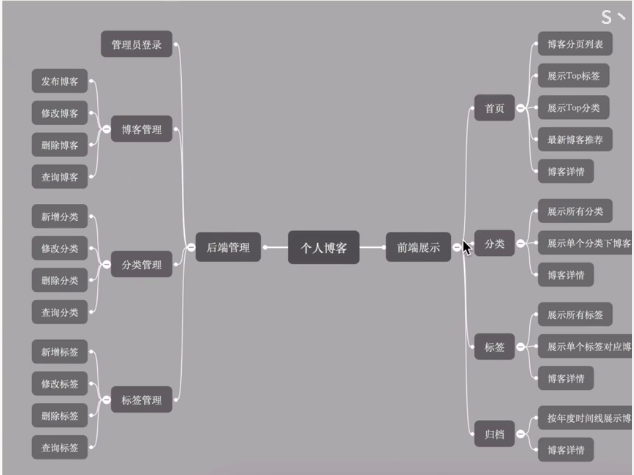

# Spring Boot开发小而美的程序

## 需求与v功能

* 用户故事

* 个人博客系统：普通访客、管理员（我）

## 主体架构

## 2、页面设计与开发

* 2.1 设计

* the next: https://www.bilibili.com/video/BV1nE411r7TF?p=6&spm_id_from=pageDriver

## 2020.02.24 22:45
* 前端展示的页面完成
* next: https://www.bilibili.com/video/BV1nE411r7TF?p=14&spm_id_from=pageDriver

## 代码高亮显示
* <pre class="language-css"><code>代码</code>  