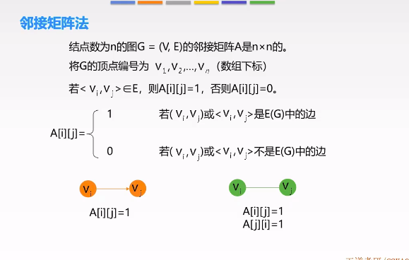
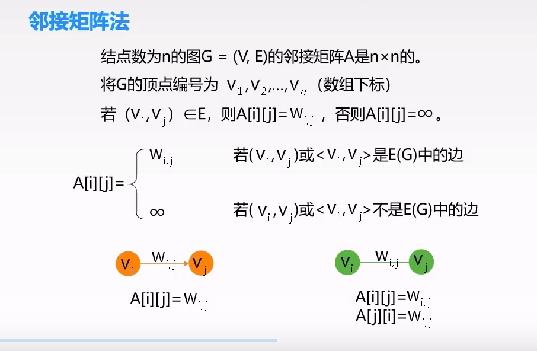
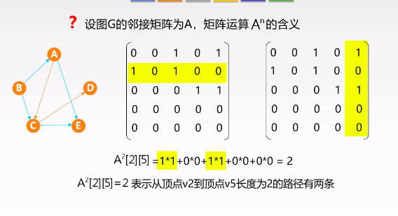
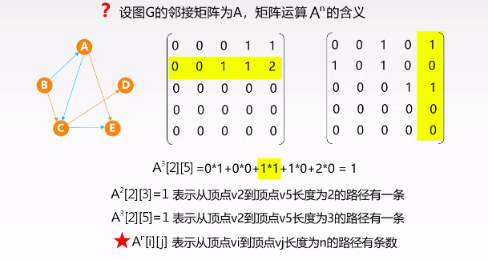

# 2021.03.20 22:20
## 图的存储结构
* https://www.bilibili.com/video/BV1b7411N798?p=50

### 邻接矩阵法

#### 存储结构

#### 代码

"""c

    #define MaxVertexNum 100
    typedef char VertexType;
    typedef int EdgeType;
    typedef strcut{
        /*使用一维矩阵记录结点*/
        VertexType Vex[MaxVertexNum];
        /*使用二维矩阵记录边*/
        EdgeType Edge[MaxVertexNum][MaxVertexNum];
        /*vexnum：结点数目
        arcnum：边的数据*/
        int vexnum,arcnum;
    }MGraph;
"""

#### 邻接矩阵法的性质
* 邻接矩阵的空间复杂度为O(n^2),适用于稠密图
* 无向图的邻接矩阵为对称矩阵
* 无向图中第i行（或者第i列）非0元素（非正无穷）的个数为第i个顶点的度
* 有向图中第i行（第i列）非0元素（非正无穷）的个数为第i个顶点的出度（入度）。

#### 问题

## next:没有保存