### 2021.03.07 15:03  图

## 图的定义
* 图（Graph）是由顶点的有穷非空集合和顶点之间边的集合组成的，通常表示为：G（V,E）,其中G表示一个图，V是图G中顶点的集合，E是图G中边的集合。

### 无向边
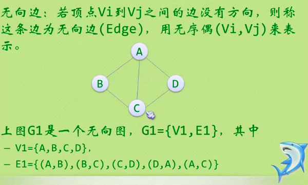

### 有向边
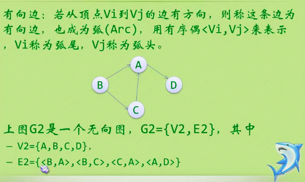

### 简单图
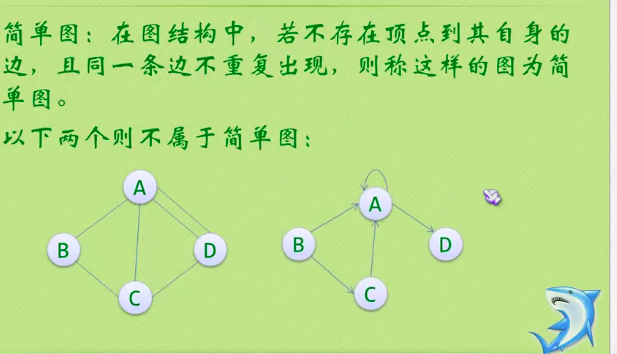

### 无向完全图
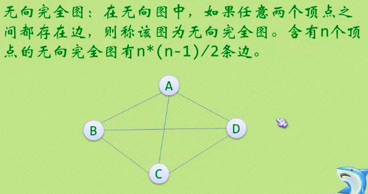

### 有向完全图
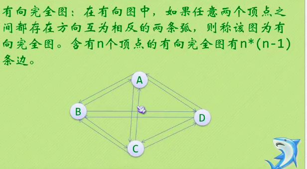

### 稀疏图和稠密图、网
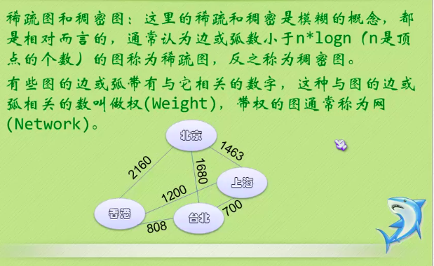

### 子图
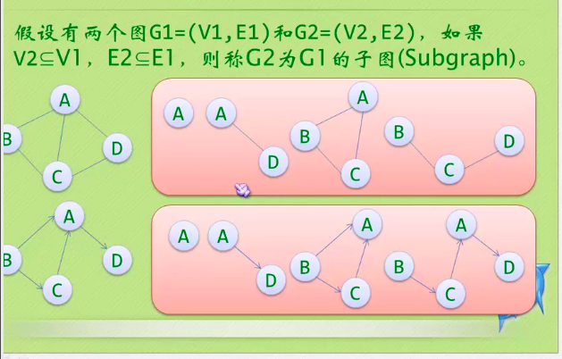

## 图的顶点与边之间的关系
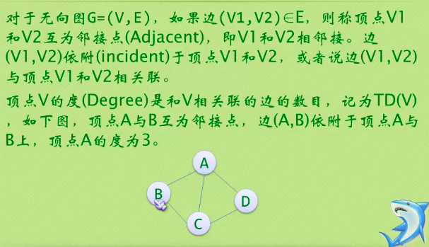

### 路径
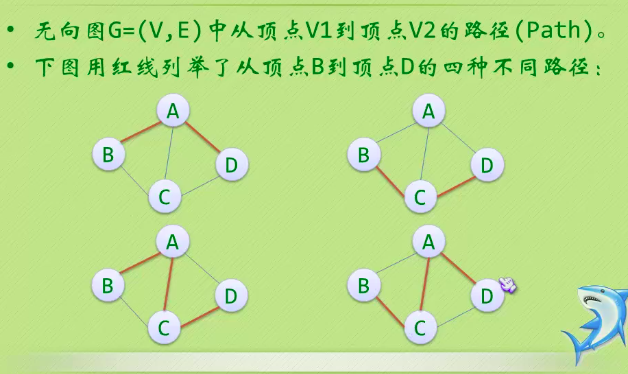
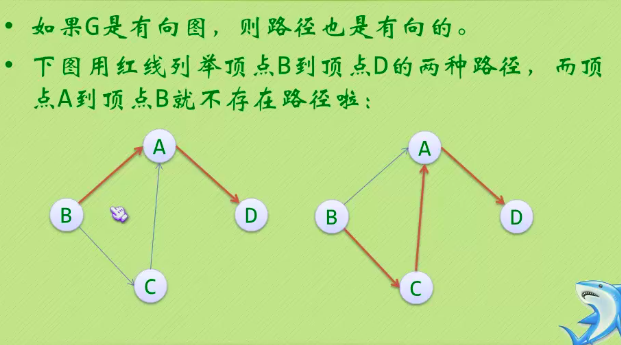

### 连通图

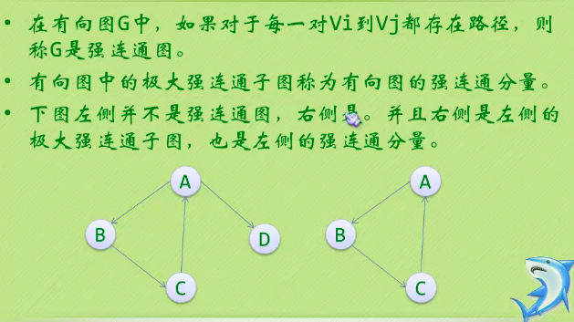

* 图中全部有n个顶点，但只有足以构成一棵树的n-1条边

### 五种图的存储结构
#### 邻接矩阵（无向图）
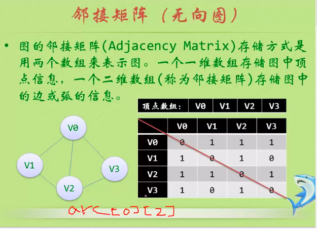
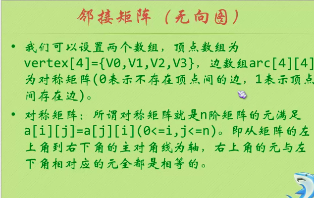
#### 邻接矩阵（有向图）
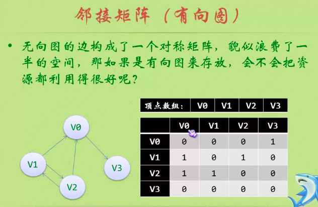
#### 邻接矩阵（网）
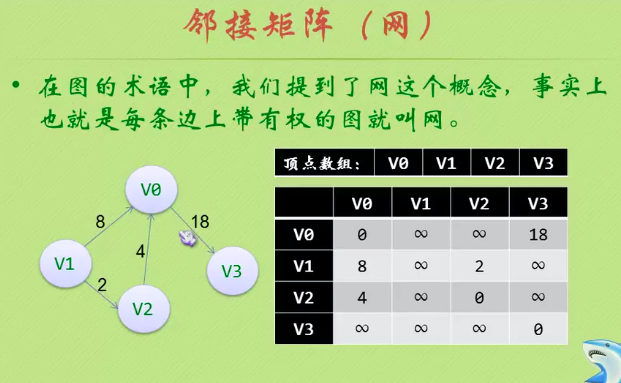

##### 2020.03.08 
### 十字链表
* 十字链表的好处就是把邻接表和逆邻接表整合在一起，这样即容易找到以Vi为尾的弧，也容易找到以Vi为头的弧，因而容易求得顶点的出度和入度。

### 邻接多重表
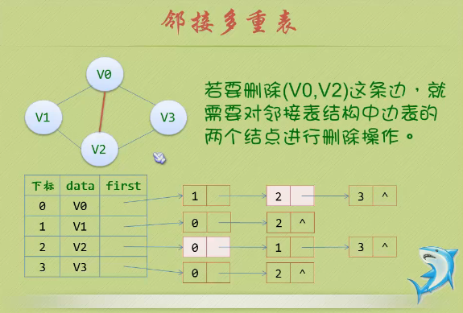

### 边集数组
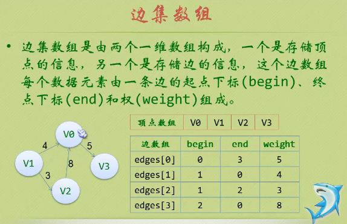

## 图的遍历
### 深度优先遍历

### 广度优先遍历

