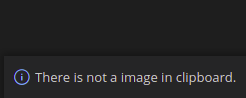
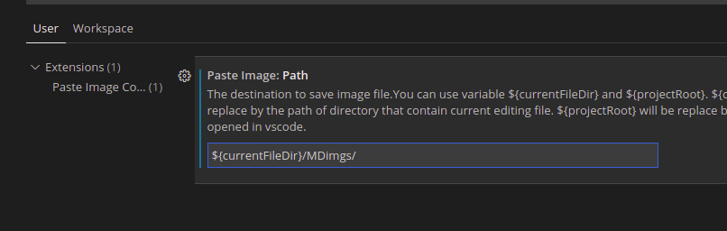

## 2021.0.11 23:02
* next : https://www.bilibili.com/video/BV1hs411T7aS?p=26

## 2020.02.13 14:51

### 中缀表达式转换为后缀表达式
* 从左到右遍历中缀表达式的每个数字和符号，若是数字则直接输出，若是符号，则判断其与栈顶符号的优先级，是右括号或者优先级低于栈顶符号，则栈顶元素依次出栈并输出，直到左括号或栈为空才将最后那个符号入栈