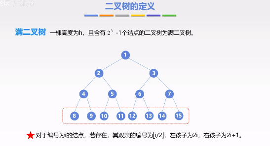
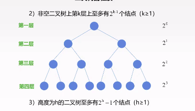
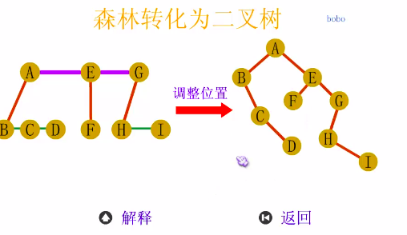
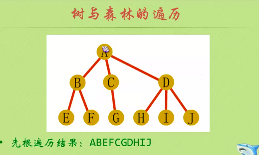

# 树

## 2021.02.22 11：00

* 一对多的数据结构

### 树的定义

### 结点分类

### 结点之间的关系

### 结点的层次

## 树的存储结构

### 双亲表示法

#### 双亲表示法图像

* https://www.bilibili.com/video/BV1hs411T7aS?p=42

## 孩子表示法

## 双亲孩子表示法

### 有序树 无序树

## 基本术语

* 树的高度（深度）是树中结点的最大层数
* 路径：树中两个结点之间的路径是由两个结点之间所经过的结点序列构成的
* 路径长度：路径上所经历边的个数
* 森林 m(m>0) 棵不相交的树的集合

## 二叉树的定义

* 二叉树是n （n>=0）个结点的有限集合
*
    * 1）n=0时，二叉树为空
*
    * 2）n>0时，由根节点和两个互不相接的被称为根的左子树和右子树组成。左子树和右子树分别为一棵二叉树。

### 五种的基本形态

### 满二叉树

* 一棵高度为h,且含有2^h - 1 个结点的二叉树为满二叉树

### 完全二叉树

* 设一个高度为h，有n个结点的二叉树，当且仅当其每个结点都与高度为h的满二叉树中编号1~n的结点一一对应时，称为完全二叉树。

#### 性质

* 若 i <= |n/2|,则结点i为分支结点，否则为叶子结点
* 叶子结点只可能在层次最大的两层上出现，对于最大层次的叶子结点，都依次排在最左边的位置上。
* 度为1的结点若存在，则可能有一个，且编号最大的分支节点，并孩子结点一定是左结点。

### 二叉排序树

* 对任意结点若存在左子树或右子树，则其左子树上所有结点的关键字均小于该结点，右子树上所有结点的关键字均大于该结点。

### 平衡二叉树

* 树上任意结点的左子树和右子树的深度只差不超过1.

## 二叉树的性质

* 1、非空二叉树上的叶子结点数等于度为2的结点数加1 : n0 = n2 + 1
*
    * n = n0 + n1 + n2
*
    * n = n1+2*n2 + 1

* 2、非空二叉树上的第k层上至多有2^(k-1)个结点（k>=1）
* 3、高度为h的二叉树至多有 2^h - 1个结点（h>=1）

* 4、左右孩子结点

## 二叉树的顺序存储

* 用一组连续的存储单元依次自上而下，自左至右存储完全二叉树上的结点元素

## 二叉树的遍历

* 按某条搜索路径访问树中的每个结点，树的每个结点均被访问一次，而且只访问一次。
* 根N 左子树L 右子树R

### 先序遍历

* N L R

### 中序遍历

* L N R

### 后序遍历

* L R N

* 先 ： A B D H I E J C F K G
* 中 ： H D I B E J A F K C G
* 后 ： H I D J E B K F G C A

### 线索二叉树
* 前序遍历，空节点直接只想结点的前驱

## 树、森林及二叉树的相互转换

### 树到二叉树的转换
* 在树中的所有兄弟结点之间加一条连线
* 对每个结点，除了保留与其长子连线外，去掉该结点与其他孩子的连线
* 

* 

### 森林转换为二叉树
* 现将森林中的每棵树变成二叉树
* 在将各个二叉树的根结点视为兄弟，从左到右连在一起，就形成了一棵二叉树。
* 

## 树与森林的遍历
* 先根遍历
* 
* 后根遍历
* 

## 赫夫曼树

### 构造哈夫曼树的过程

### 哈夫曼编码

#### 部件
* primority queue 从小到大依次排列各个字符出现的次数
* huffmanTree 
* encode 编码过程
* decode 解码过程

