* https://www.bilibili.com/video/BV1hs411T7aS?p=8
## 线性表的顺序存储结构
* 线性表有两种存储结构：顺序存储结构和链式存储结构
* 线性表的顺序存储结构，指的是用一段地址连续的存储单元依次存储线性表的数据元素

#### 线性表的顺序存储结构
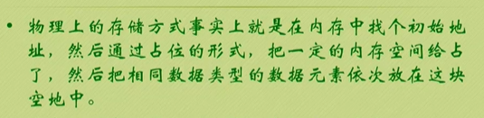

""" c

    // 线性表顺序存储的结构代码
    #define MAXSIZE 20
    typedef int ElemType;
    typedef struct 
    {
        ElemType data[MAXSIZE];
        int length;//线性表的长度
    }SqList;

"""

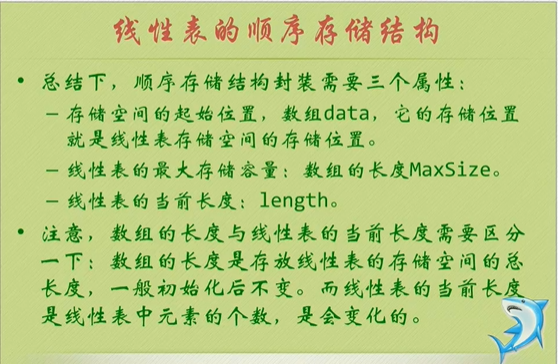

#### 2021.1.3 18:33 
* the next : https://www.bilibili.com/video/BV1hs411T7aS?p=9

##### 删除操作

#### 线性表顺序存储结构的优缺点
##### 优点：
* 无须为表示表中元素之间的逻辑关系而增加额外的存储空间
* 可以快速地存取表中任意位置的元素
##### 缺点：
* 插入和删除操作需要移动大量元素
* 当线性表长度变化较大时，难以确定存储空间的容量
* 容易造成存储空间的“碎片”

## 线性表链式存储结构定义
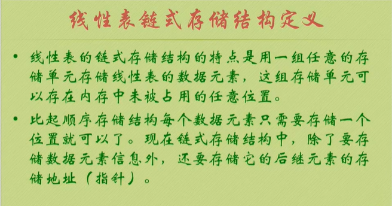
* 存储数据元素信息的域为数据域
* 存储直接后续位置的域为指针域
* 指针域中存储的信息称为指针或链
* 这两部分信息组成的数据元素称为存储映像，称为结点

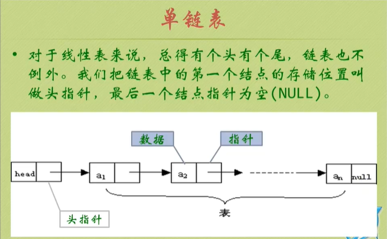

#### 头指针
* 头指针是指链表指向第一个结点的指针，若链表有头结点，则是指向头结点的指针
* 头指针具有标识作用，所以常用头指针冠以链表的名字
* 无论链表是否为空，头指针均不为空
* 头指针是链表的必要元素

#### 头指针与头结点的异同

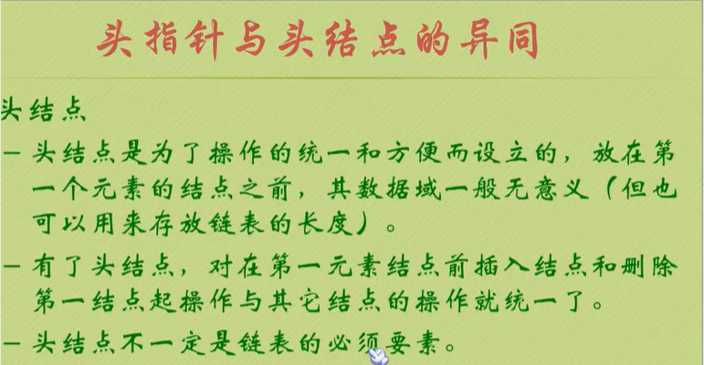

#### 获得链表第i个数据的算法思路

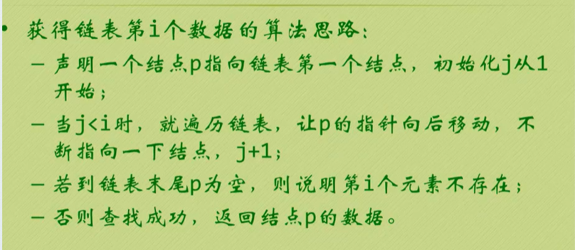

#### 单链表的插入

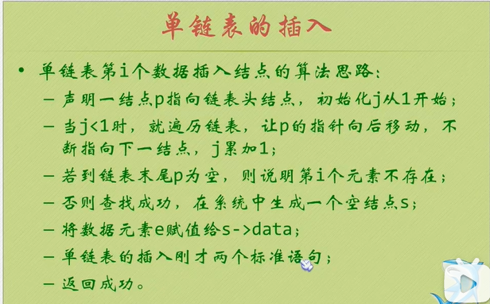

#### 单链表的整表创建

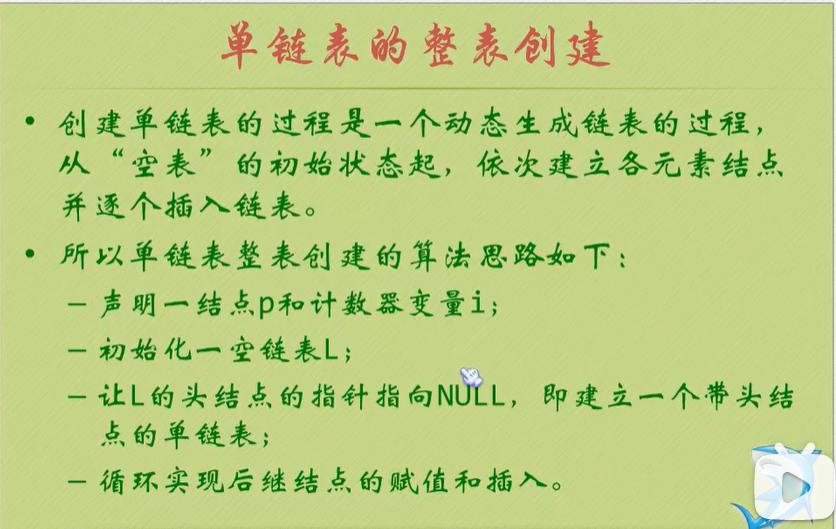

#### 头插法建立单链表

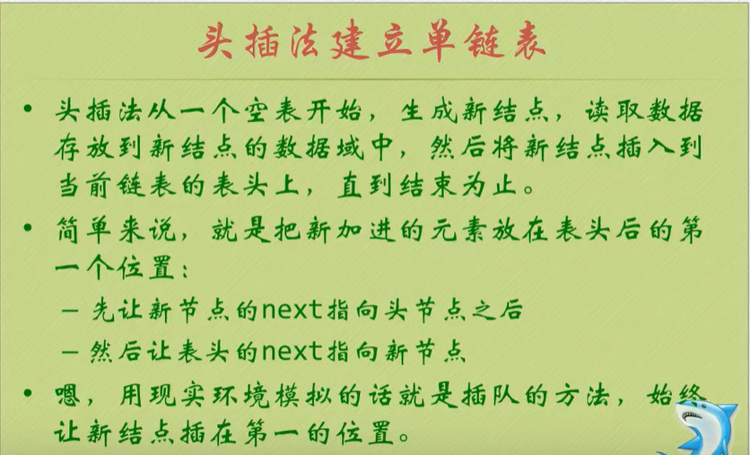

#### 尾插法建立单链表

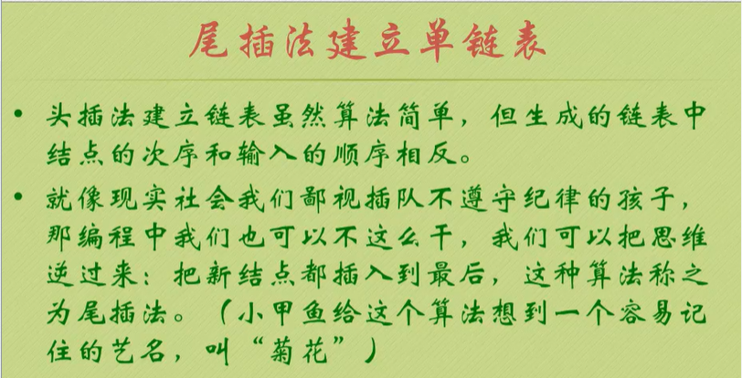

##### 2021.1.3 22:35
* next :  https://www.bilibili.com/video/BV1hs411T7aS?p=13

#### 单链表的整表删除

##### 单链表结构与顺序存储结构优缺点
* 存储分配方式
* * 顺序存储结构用一段连续的存储单元依次存储线性表的数据元素
* * 单链表采用链式存储结构，用一组任意的存储单元存放线性表的元素
* 时间性能
* * 顺序存储结构O(1)
* * 单链表O(n)
* 插入和删除
* * 顺序存储结构需要平均移动表长一半的元素，时间为O(n)
* * 单链表在计算出某位置的指针后，插入和删除时间仅为O(1)
* 空间性能

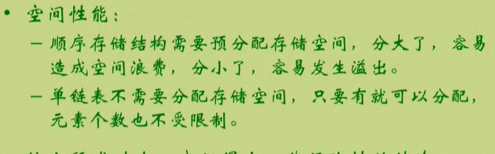

* 结论
* * 若线性表需要频繁查找，很少进行插入和删除操作的时候，宜采用顺序存储结构
* * 若需要频繁插入和删除时候，宜采用单链表结构

#### 静态链表的插入操作
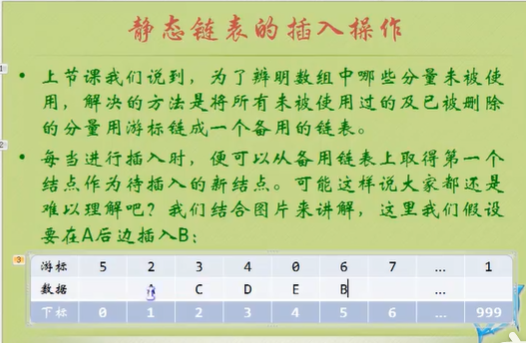

#### 循环链表
* 绕
* 只需将单链表中的终端结点的指针由空指针改为指向头结点

* the next:https://www.bilibili.com/video/BV1hs411T7aS?p=19

#### 双向链表
* 题目1
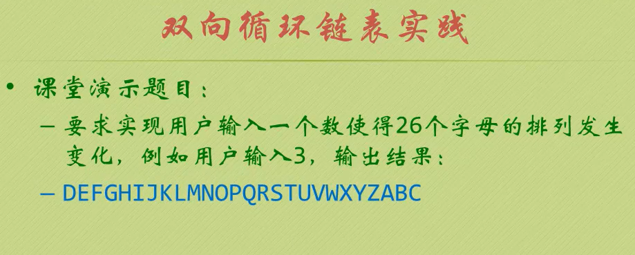

